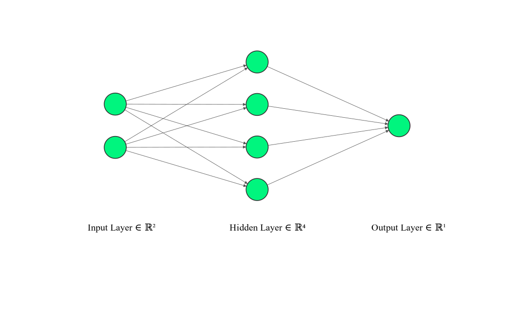

# Shallow Neural Network (2-Layers)

 

 

##### In this repo I have built a 2 layers neural network from scratch and explained it step by step.
##### The network is predicting the color of the points in XOR dataset.
##### All the equations are included in the notebook
#### The Jupyter notebook includes the following:
- How to generate our training data and label it using **NumPy**.
- What is the activation functions and their rule in the network.
- The mathematical equations of **Sigmoid** and **tanh**.
- How to initialize the parameters and the importance of breaking the symmetry.
- How are forward and backward propagation being implemented and all the mathematical equations for them.
- How to update the parameters after calculating gradients using gradient descent.
- Training a model to predict the color of points.
